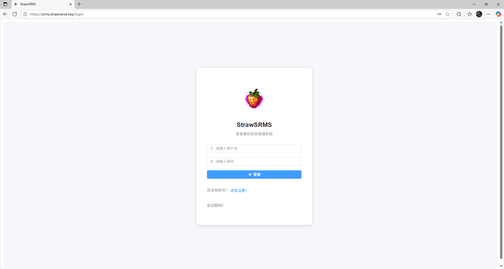
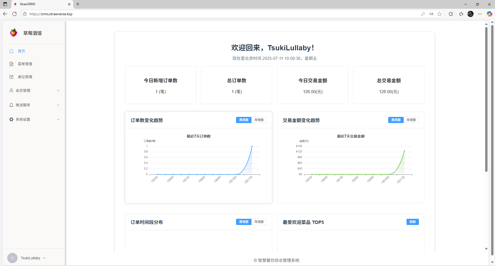

# 🍓 智慧餐饮综合管理系统 (StrawSRMS)

> **多租户 SaaS 餐饮解决方案** |    
> 为中小餐饮企业提供一站式数字化管理平台，支持多店铺运营、会员管理、实时数据分析和智能营销

---

## ✨ 核心功能

- **🔐 多租户架构** - 账号数据物理隔离，保障商家数据安全
- **📊 智能数据看板** - 实时销售分析 + 菜品TOP5排名
- **🎯 会员管理体系** - 自定义会员等级与权益规则
- **🛡️ JWT 安全认证** - 基于 Spring Security 的权限控制
- **📱 多渠道通知** - 邮件+短信推送服务（开发中）
- **🎨 主题个性化** - 支持界面主题切换

---

## 🚩 最新动态

### v0.0.5 亮点更新
- **重大更新** 实现了分店功能，一租户可以有多个店铺，每个店铺的数据相互独立。
- 优化了导航栏，现在可以将导航栏收起。
- 性能优化，修复了一些已知问题。
- 增加了一些新bug。

**▶ [查看完整更新日志](CHANGELOG.md)**  
**⏭ 下一版本预告**：自定义推送功能

---

## 🛠 技术栈

| 类别        | 技术选型                     |
|-------------|-----------------------------|
| **后端**    | Java 8 • Spring Boot 2.x    |
| **安全**    | Spring Security • JWT       |
| **数据库**  | MySQL 8 • Redis 6           |
| **ORM**     | MyBatis-Plus                |
| **工具**    | Lombok • Maven              |
| **部署**    | Nginx                       |

---

## 环境准备
1. JDK 1.8+
2. MySQL 5.7+
3. Redis 5.0+

---

## 🌐 在线体验

**演示环境已部署在草莓宇宙：**  
🔗 [https://srms.strawverse.top](https://srms.strawverse.top)

**关于使用**

可以自行使用注册功能注册账号使用该系统
注意！后续版本更迭可能将会要求商业化的许可证

---

## 图片展示

### 🖼️ 系统登录界面

### 📊 后台首页

---

## 🍓 关于草莓宇宙

**StrawVerse** 是开发者构建的个人技术生态体系，SRMS 是首款落地应用  
> *"程序员的宇宙，从一行代码开始"* —— 2025.07.10 正式上线

---

## 🤝 参与贡献

目前项目暂不接受代码贡献，但欢迎提供建议

---

## 📮 联系我们

| 事项               | 联系方式                          |
|--------------------|----------------------------------|
| **技术合作**       | 398670671@qq.com              |
| **个人主页**       | [@TsukiLullaby](https://github.com/TsukiLullaby) |

---

© 2025 [TsukiLullaby](https://github.com/TsukiLullaby) • 保留所有权利

---